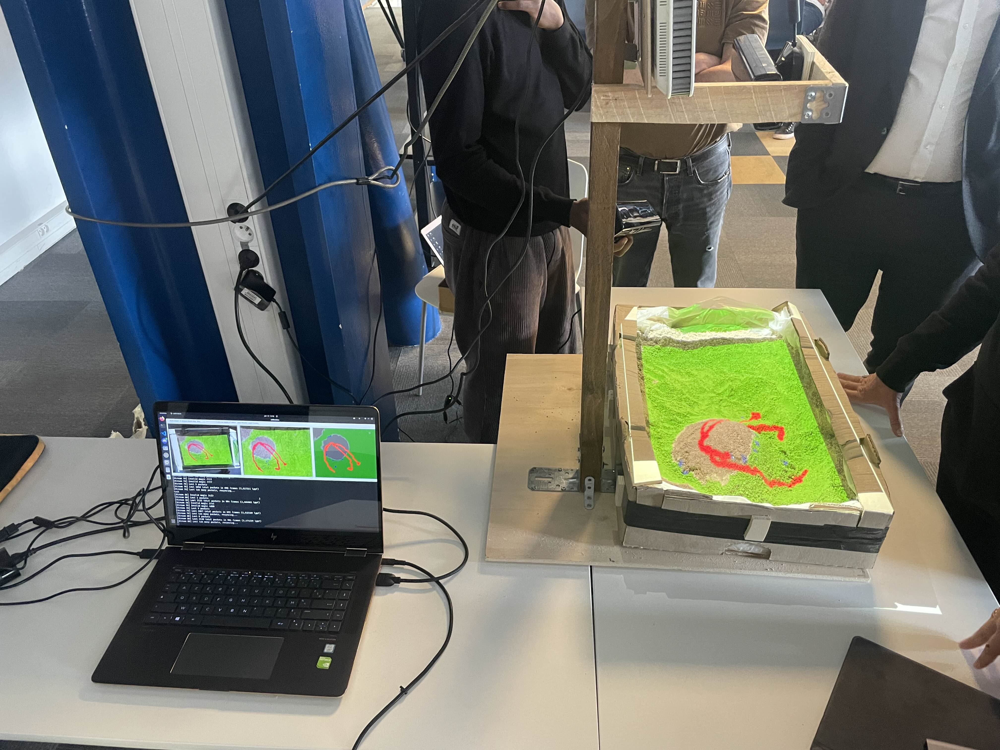

# CodeFestWeek

Dans le cadre du projet CodeFestWeek nous avons réalisé un simulateur d'éruption volcanique. Le principe est de formé un volcan avec le sable pour ensuite regarder la simulation s'exécuter en direct sur le model construit.



## Pré-requis

- Kinect V1
- Projecteur
- Bac à sable
- Ordinateur

La kinect et le projecteur doivent être fixés au dessus du bac à sable à un minimum de 50cm. Le bac à sable doit lui être à 1m20 de hauteur.

## Run project

```
git clone https://gitlab.cri.epita.fr/tom.pauwels/codefestweek
cd codefestweek
mkdir build
cd build
cmake ..
make
sudo ./calibration
```

Il faut construire le volcan et le terrain voulu avant de lancer la dernière commande. Sur l'interface il faut load la calibration dans les 5 secondes après le lancement, cocher miror si nécessaire et afficher la map.

## Bibliothèque

- OpenCV 4
- libfreenect
- libUSB 1.0
- OpenGL
